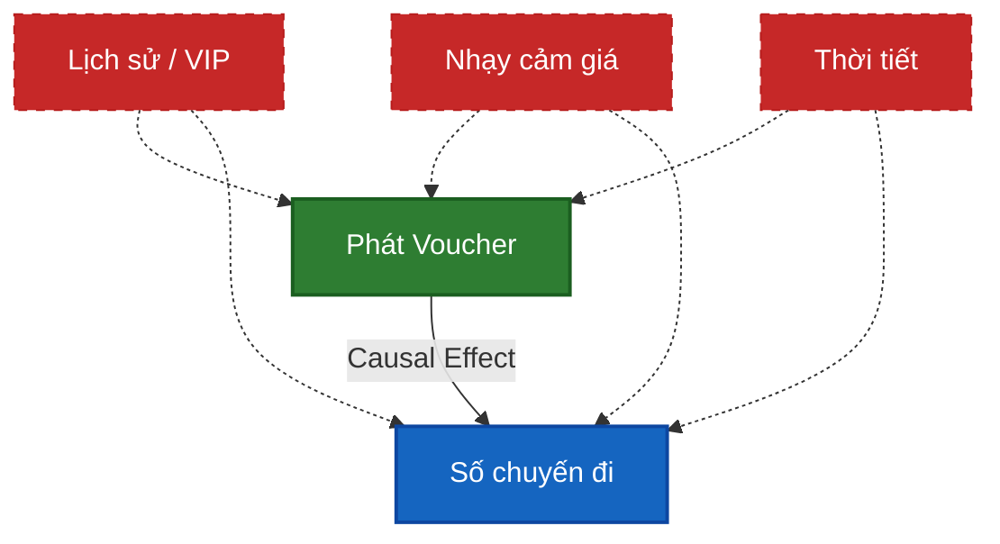

# Bài tập Tuần 1: Causal Thinking 101

*Chủ đề: Đánh giá tác động của Voucher Khuyến mãi đối với số lượng chuyến xe (Rides)*

## 1. Causal Question (Câu hỏi Nhân quả)
Việc phát voucher khuyến mãi (Treatment) có thực sự tạo ra thêm chuyến đi mới (Incremental Rides), hay khách hàng vốn dĩ đã có ý định đặt xe rồi và chỉ nhân tiện xài voucher?

## 2. Định nghĩa Biến số
- **Treatment (T - Biến can thiệp):** Khách hàng nhận được Voucher giảm giá 20%. (T=1: Nhận mã, T=0: Không nhận mã).
- **Outcome (Y - Kết quả):** Tổng số chuyến xe (Rides) mà khách hàng hoàn thành trong vòng 7 ngày sau đó.

## 3. Xác định 3 Confounders (Biến can nhiễu)
Confounder là những yếu tố vừa ảnh hưởng đến việc khách hàng *có nhận được mã hay không* (hoặc có dùng mã hay không), vừa ảnh hưởng đến *số chuyến đi* của họ.
1. **Lịch sử sử dụng (Historical Ride Frequency / Loyalty):** Khách hàng VIP thường xuyên dùng App sẽ dễ bắt gặp banner khuyến mãi hơn, đồng thời bản thân họ cũng đi xe nhiều hơn bình thường (không cần mã họ vẫn đi).
2. **Mức độ nhạy cảm về giá (Price Sensitivity / Income):** Khách hàng là sinh viên có thu nhập thấp sẽ tích cực săn mã hơn, nhưng tần suất đi xe công nghệ tổng thể của họ lại thấp hơn giới văn phòng.
3. **Thời tiết (Weather):** Trời mưa to khiến công ty tung ra nhiều surge pricing (tăng giá) kèm theo mã giảm giá để xoa dịu, đồng thời trời mưa cũng làm tăng nhu cầu đặt xe taxi.

## 4. DAG (Directed Acyclic Graph)
Sơ đồ DAG đơn giản mô tả mối quan hệ nhân quả.

## 5. Tại sao so sánh Naive (Treated vs Untreated) lại bị Bias (Thiên lệch)?
**Naive Comparison** là phép so sánh trung bình số chuyến đi của nhóm dùng mã (Treated) với nhóm không dùng mã (Untreated). Phương pháp này **sai hoàn toàn và bị Bias nặng nề** vì:

* Hiện tượng **Selection Bias (Thiên lệch chọn mẫu)**: Khách hàng trong nhóm Treated (nhận/dùng mã) không được chọn ngẫu nhiên. Thông thường, những người lấy được mã thường là những khách hàng trung thành, sử dụng App hàng ngày (VIP). Nhóm Untreated thường là những người ít mở App.
* Khi ta thấy nhóm Treated có trung bình 5 chuyến/tuần, nhóm Untreated có 1 chuyến/tuần. Ta kết luận: *"Voucher giúp tăng 4 chuyến xe"* là **Ảo tưởng (Spurious Correlation)**. Sự chênh lệch 4 chuyến này thực chất là do bản chất họ là KH VIP (Confounder), chứ không phải do tác động của cái Voucher.
* **Kết luận:** Naive comparison trộn lẫn Causal Effect (tác động thật) với Selection Bias (hiệu ứng của Confounders). Để khử Bias này, ta buộc phải dùng **Randomized Controlled Trial (A/B Testing)** hoặc các phương pháp Observational Causal Inference (Matching, DiD) để đóng các đường nhiễu (block backdoor paths).
